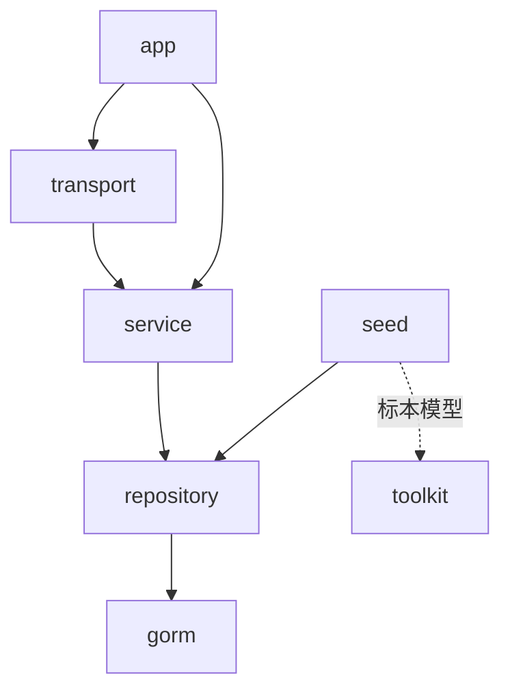

# 服务端文档

量潮议事云 provider（决议服务）的设计文档集。落地于 `src/provider` Go 模块：决议领域按 `model / repository / service / transport` 分包，`cmd/server` 统一组装。

## 文档导航

| 文档 | 内容 |
|------|------|
| [resolution](resolution.md) 决议领域 | 模型、存储（Repository + GORM）、服务、HTTP 端点 |

## 模块总览

| 模块 | 包 | 职责 |
|------|-----|------|
| 决议 | `internal/resolution` | 决议 CRUD：模型、Repository 接口、Service（UUID 生成、校验）、transport（路由注册） |
| 存储 | `internal/resolution/gorm` | Repository 的 GORM 实现（开发 SQLite / 生产 PostgreSQL 方言切换） |
| 装配 | `internal/app` | 数据库打开（方言切换 + AutoMigrate + SQLite 单连接）、依赖注入与路由注册 |
| 测试替身 | `internal/store` | MVP 遗留存储抽象；内存 `ResolutionRepo` 实现 Repository 接口 |
| 种子 | `internal/resolution/seed` | 从云端 GitHub（raw）拉取 profile 决议标本导入（幂等） |

## 依赖关系



- `transport`（HTTP handler）→ `service`（业务规则）→ `repository`（存储接口）→ `gorm`（实现）
- 方法以 `*gorm.DB` 为首参，事务由调用方（service）编排
- `seed` 引用工具库标本模型（`quanttide-delib-toolkit`）解析云端 JSON，再经 repository 幂等写入

## 运行

```sh
make run          # 本地（SQLite qtcloud-delib.db）
make docker-up    # docker compose（SQLite 挂载 ./data）
go run ./cmd/seed # 导入种子数据（云端 GitHub 拉取，幂等）
```

配置经环境变量注入：`DB_DRIVER` / `DATABASE_URL` / `DB_SQLITE_DSN` / `LISTEN_ADDR`。
